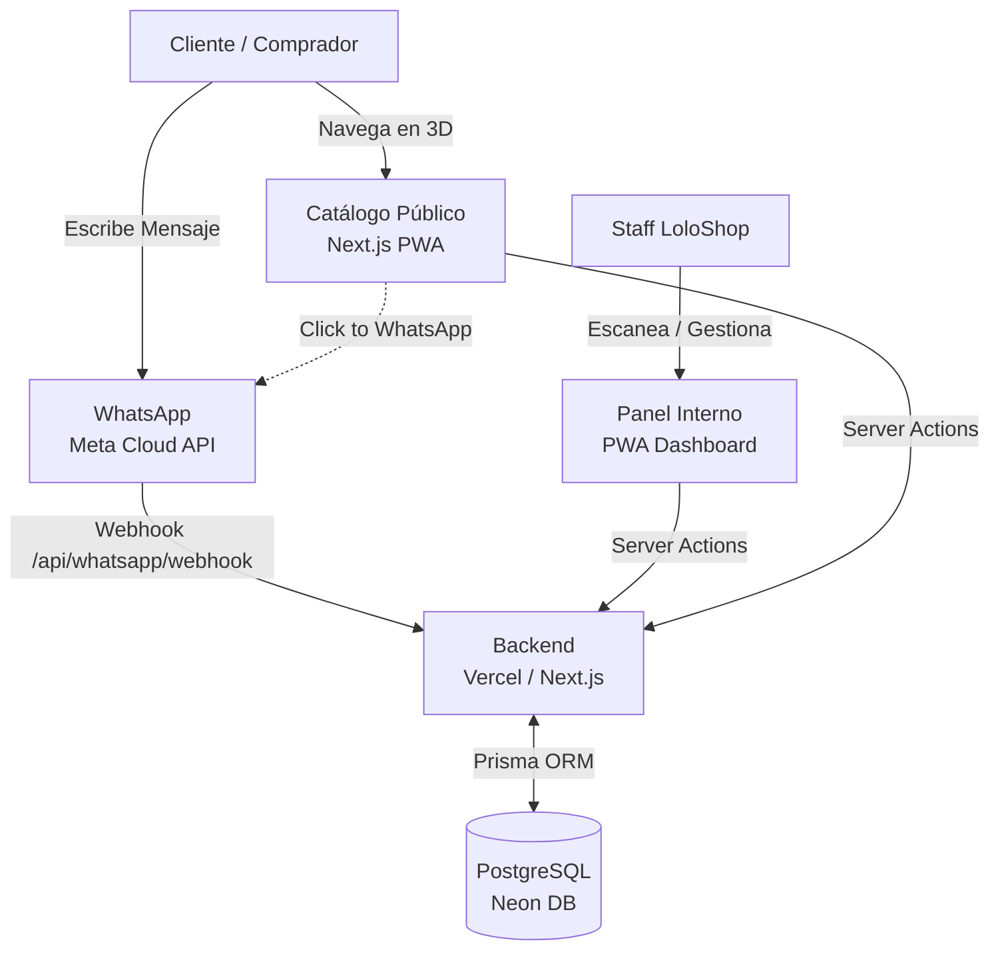

# LoloShop 🧢

Aplicación integral de gestión de inventario, catálogo interactivo en 3D y bot de WhatsApp automatizado para una tienda de streetwear.

<p align="center">
  
  
  
</p>

## Arquitectura del Sistema



## Características Principales

1. **Gestión de Inventario (PWA):**
   - Panel de KPIs con métricas en tiempo real.
   - Escáner de código de barras para entradas y salidas rápidas.
   - Alertas visuales de stock bajo.
   - Sincronización instantánea entre sucursales.

2. **Catálogo Interactivo 3D (`/catalogo`):**
   - Renderizado dinámico usando `framer-motion` a 60 FPS.
   - Efectos físicos realistas de iluminación ("Glare") basados en acelerómetro y posición del mouse.
   - Conexión fluida hacia WhatsApp para apartar prendas ("FOMO").

3. **Bot de WhatsApp Oficial (Meta Cloud API):**
   - Webhook inteligente integrado en Next.js (`/api/whatsapp/webhook`).
   - Lee el catálogo en vivo desde Prisma/Neon.
   - Reserva de prendas lógicamente y redirige al cierre de la venta.
   - Respuestas preconfiguradas para FAQs (envíos y ubicación).

## Stack Tecnológico

- **Frontend:** Next.js 14 (App Router), React, TailwindCSS, Framer Motion
- **Backend:** Node.js, Prisma ORM
- **Base de Datos:** PostgreSQL (Neon)
- **Infraestructura:** Vercel, PWA (next-pwa)
- **Autenticación:** NextAuth.js

## Flujo de Negocio: WhatsApp Bot

El catálogo público manda a los usuarios a WhatsApp con un SKU prellenado. El bot realiza la lectura de intención:
- Si dicen **"Apartar SKU: XYZ"**: Busca en la BD. Si hay stock, confirma la reserva de 24 horas y manda el link de compra final.
- Si dicen **"Envíos"**: Lanza la macro de envíos y paqueterías.
- Si dicen **"Ubicación"**: Lanza horarios y dirección.

## Configuración local

1. Copia `.env.example` a `.env` y llena los valores (el archivo `.env` **no** se commitea).
2. Sincroniza el esquema y siembra datos iniciales:

```bash
npm install
npm run db:push   # aplica prisma/schema.prisma a la BD
npm run db:seed   # tiendas (loc-1/loc-2), usuarios con bcrypt y producto demo
```

Las contraseñas del seed se pueden definir con `SEED_PASSWORD_*` (ver `.env.example`); sin ellas usa valores de desarrollo.

## Despliegue en Vercel

El proyecto está configurado para Vercel. Asegúrate de configurar las siguientes variables de entorno:
- `DATABASE_URL`
- `NEXTAUTH_SECRET` — genera uno con `openssl rand -base64 32`
- `WHATSAPP_TOKEN`
- `WHATSAPP_VERIFY_TOKEN`
- `WHATSAPP_APP_SECRET` — App Secret de Meta; valida la firma de cada webhook entrante
- `BOT_API_KEY` — clave para `/api/bot/products` (n8n); sin ella el endpoint responde 503
- `NEXT_PUBLIC_WHATSAPP_NUMBER` — número del catálogo público, con código de país

**(El comando de postinstall `prisma generate` corre automáticamente en Vercel).**

> ⚠️ **Seguridad:** si alguna credencial llegó a estar commiteada en el historial del repo
> (cadena de conexión de la BD, `NEXTAUTH_SECRET`), considérala comprometida y rótala.
