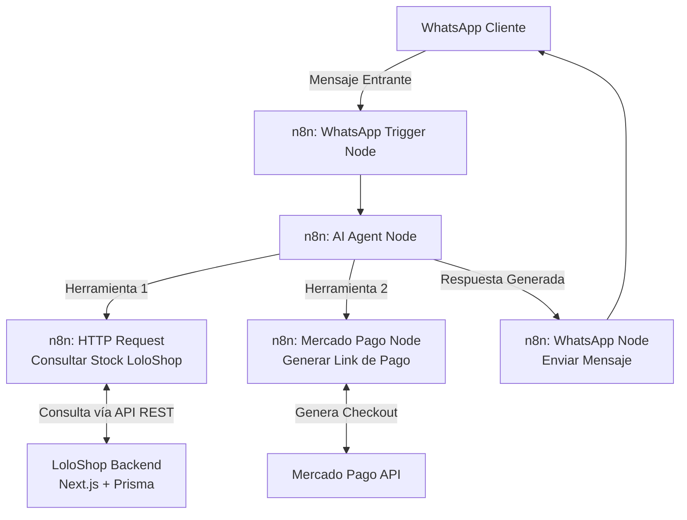

# Plan de Automatización: Chatbot de WhatsApp con n8n para LoloShop 🤖

Este documento detalla el plan paso a paso para construir y desplegar el flujo de automatización del chatbot de WhatsApp utilizando la instancia local de **n8n**, integrando IA (Claude/OpenAI) para mantener una conversación natural y cerrando ventas mediante Mercado Pago.

---

## 1. Arquitectura del Flujo (Workflow)

El flujo de n8n orquestará la comunicación entre el cliente, la Inteligencia Artificial y la base de datos de LoloShop (Neon DB).

---

## 2. Configuración de Credenciales en n8n

Antes de construir los nodos, deberás configurar las siguientes credenciales en tu n8n local:

1. **Meta WhatsApp Cloud API:** 
   - Necesitarás un *Permanent Access Token* y el ID del número de teléfono.
2. **Modelo de Lenguaje (LLM):**
   - **Anthropic API (Recomendado - Claude 3 Haiku)** o **OpenAI API (gpt-4o-mini)**. Estos modelos son rápidos y muy económicos para este volumen.
3. **Mercado Pago API:**
   - *Access Token* de producción de tu cuenta de Mercado Pago para generar links de pago automatizados.
4. **LoloShop API Key (Header `x-bot-key`):**
   - Una clave secreta para que n8n pueda consultar los datos internos del inventario de forma segura.

---

## 3. Nodos a Implementar en el Canvas de n8n

El flujo principal se divide en los siguientes bloques (nodos):

### 🔸 Nodo 1: Webhook / Trigger
- **Tipo:** `WhatsApp Trigger` o `Webhook` (recibiendo eventos de Meta).
- **Función:** Escucha mensajes entrantes. Extrae el número del remitente y el texto enviado.

### 🔸 Nodo 2: AI Agent (Orquestador Principal)
- **Tipo:** `AI Agent` (Advanced Agent).
- **Prompt del Sistema:**
  > "Eres el asistente de ventas de LoloShop, una tienda exclusiva de streetwear. Tu objetivo es confirmar la disponibilidad de tallas, responder dudas de envío y generar links de pago si el cliente quiere apartar/comprar. Sé amable, conciso y utiliza el estilo FOMO (Fear Of Missing Out)."
- **Memoria:** Se le conecta un nodo `Window Buffer Memory` o `Postgres Chat Memory` (usando el número de WhatsApp como `Session ID`) para que el bot recuerde el contexto de la charla.

### 🔸 Nodo 3: Herramienta - Consultar Catálogo (Tool)
- **Tipo:** `HTTP Request Tool` conectada al *AI Agent*.
- **Endpoint:** `GET https://lolo-shop.vercel.app/api/bot/products?q={{query}}`
- **Función:** Cuando el cliente pregunta *"¿Tienen playeras negras?"*, la IA invoca esta herramienta para consultar el inventario en tiempo real.

### 🔸 Nodo 4: Herramienta - Generar Pago (Tool)
- **Tipo:** `Mercado Pago Node` o `HTTP Request Tool` conectada al *AI Agent*.
- **Endpoint:** API de *Checkout Preference* de Mercado Pago.
- **Función:** Genera un link de pago por el monto total de las prendas solicitadas.

### 🔸 Nodo 5: Respuesta (Output)
- El AI Agent formula la respuesta (ej. *"Sí, tenemos la playera negra en talla M. Cuesta $299. Aquí está tu link para apartarla: [link]"*).
- **Tipo:** `WhatsApp Node` (Acción: Send Message).
- **Función:** Envía el texto de vuelta al cliente.

---

## 4. Adaptaciones en el Código de LoloShop (Next.js)

Para que n8n pueda leer el inventario, debemos crear un endpoint exclusivo y seguro en nuestro backend de Vercel.

**Ruta a crear:** `app/api/bot/products/route.ts`
- **Método:** `GET`
- **Seguridad:** Validar un header `x-bot-key` para evitar accesos públicos.
- **Lógica:** Leer de `Prisma` los productos que tengan `available > 0` y devolverlos en formato JSON súper simplificado para que la IA gaste menos tokens al leerlo.

---

## 5. Siguientes Pasos (Ejecución)

1. **Paso 1:** Crear la ruta `/api/bot/products` en Next.js y hacer el commit.
2. **Paso 2:** Abrir la interfaz de tu n8n local (`http://localhost:5678`).
3. **Paso 3:** Crear el flujo (arrastrar los nodos mencionados) y vincular la IA.
4. **Paso 4:** Exponer el puerto de n8n (usando **Ngrok** o **localtunnel**) para que Meta WhatsApp pueda enviar los webhooks a tu computadora mientras desarrollamos.
5. **Paso 5:** ¡Prueba en vivo desde tu celular!

*¿Comenzamos programando el endpoint de lectura en Next.js para alimentar a tu n8n?*
